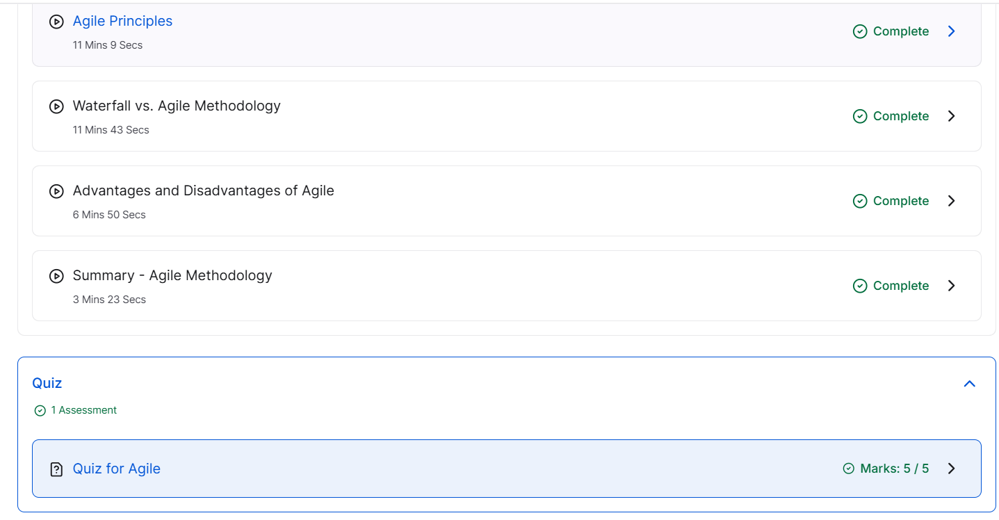
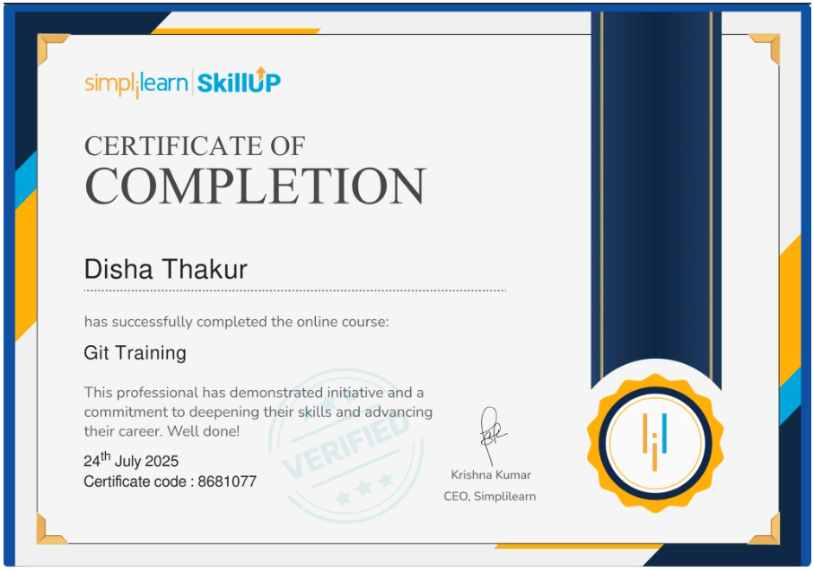
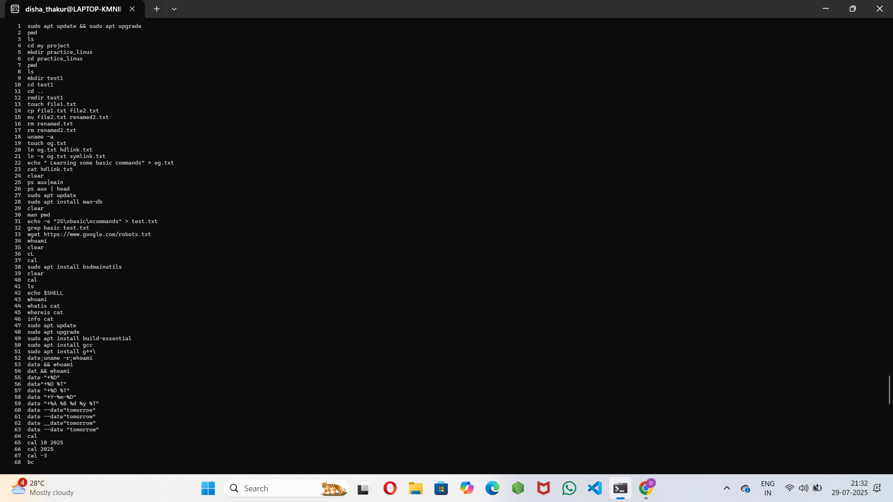
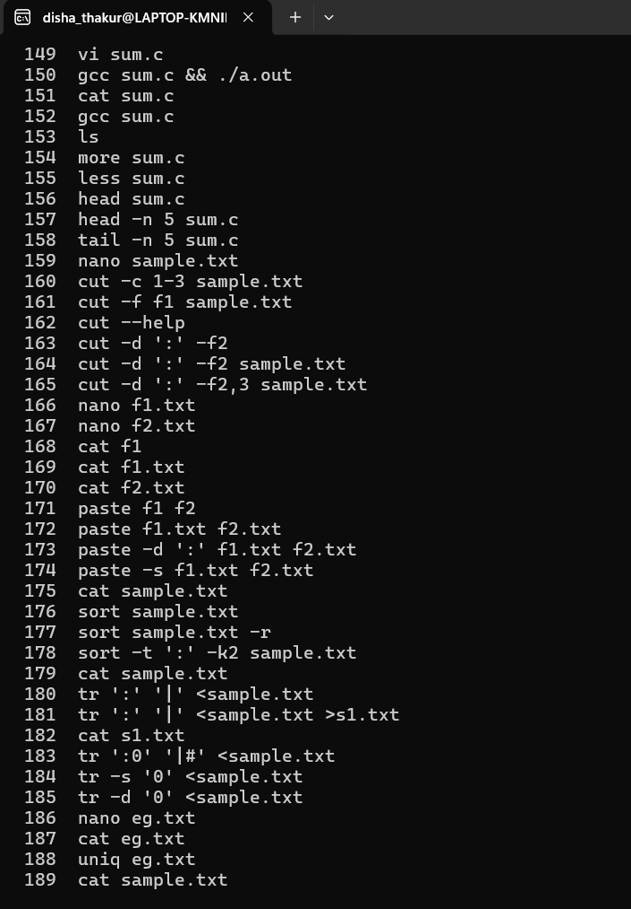
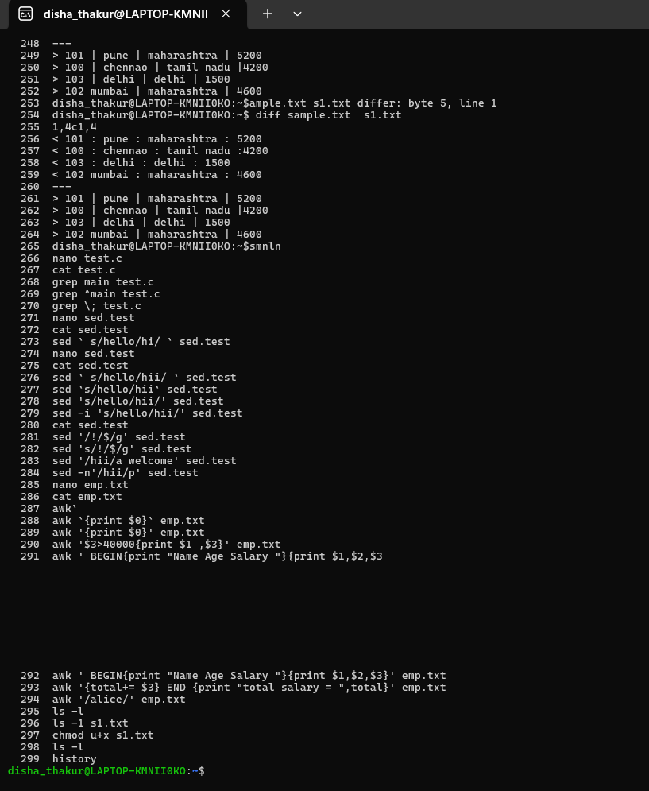

# 5211027_Disha
I have scored 5 out of 5 in Agile for Beginners on Great Learning.

I have completed the SimpliLearn Git course and please find the attach certificate.

I have practiced below attach commands.

Basic Command practice 2nd screenshot

Day 2 of practicing the Linux Commands

Solo Learn Certificate - Introduction to C Langugae

